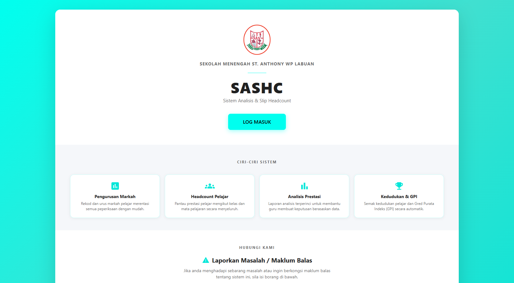
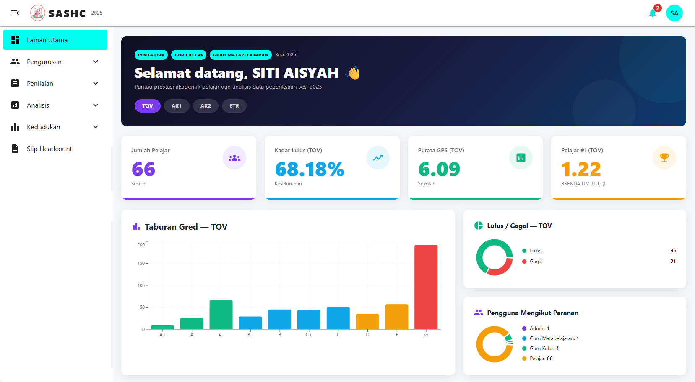
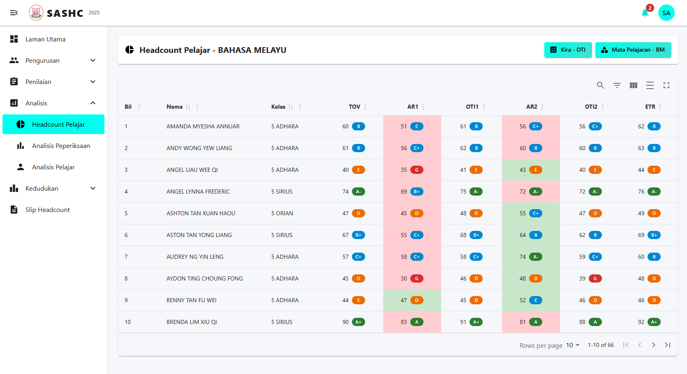
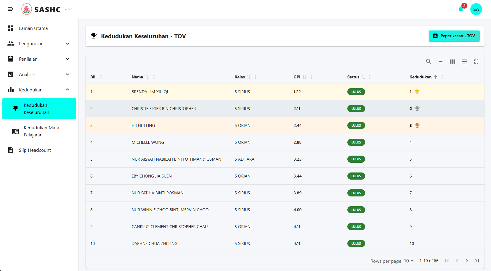
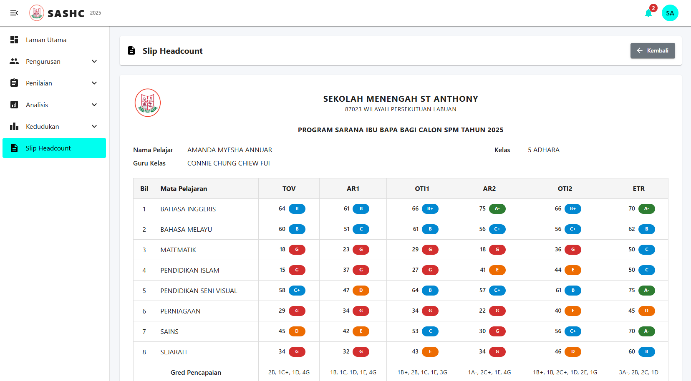

# Sekolah Menengah St. Anthony Headcount System

**A web-based academic performance tracking and analysis platform for SPM students**

---

### 🏠 Homepage

### 📊 Dashboard

### 📋 Headcount

### 🏆 Ranking

### 🧾 Headcount Slip

---

## About

The **Sekolah Menengah St. Anthony Headcount System (SASHC)** is a centralized web platform designed to streamline the academic performance management of Form 5 (SPM) students. It replaces manual headcount processes by digitizing the tracking of key academic metrics (**TOV**, **ETR**, **AR**, and **OTI**) and surfacing data-driven insights for administrators, teachers, and students through dashboards, analysis views, and printable headcount slips.

The system also integrates a **Random Forest Regression AI model** to predict student OTI targets, providing teachers with an intelligent alternative to manual formula-based calculations.

---

## Tech Stack

| Layer | Technology |
|---|---|
| Frontend | React.js |
| Backend | Django (Python) |
| Database | PostgreSQL |
| AI / ML | Random Forest Regression (scikit-learn) |

---

## System Modules

### 📊 Headcount Module
- Bulk-upload TOV, ETR, and AR records via Excel template
- Auto-calculates letter grades on submission
- Calculate OTI via predefined formula **or** AI prediction model

### 📈 Analysis Module
- Exam-level analysis showing **GPMP** (subject grade average) and **GPS** (school grade average)
- Individual student analysis with **GPI** (individual grade average) and performance charts

### 🏆 Ranking Module
- Overall student ranking by GPI across all subjects
- Subject-level ranking by individual exam scores

### 🧾 Headcount Slip Module
- View and print formatted headcount slips (TOV / ETR / AR / OTI)
- Admin and class teachers can print single, multiple, or all student slips
- Students access only their own slip

### 👤 User Module
- JWT-based authentication with password reset via email
- Profile management (photo, name, gender)
- Admin can add users individually or via Excel bulk upload (with auto-email to new accounts)

### 🗂️ Class & Subject Modules
- Full CRUD for Form 5 classes and SPM subjects
- Bulk upload support via downloadable Excel templates

### 💬 Feedback Module
- Public feedback form on the homepage (no login required)
- Admin inbox with unread count badge, read/unread toggling, filtering, and deletion

---

## User Roles & Permissions

| Role | Capabilities |
|---|---|
| **Admin** | Full access to manage users, classes, subjects, TOV data, feedback, print all slips |
| **Subject Teacher** | Manage ETR and AR for assigned subjects; view headcount and analysis |
| **Class Teacher** | View headcount slips, analysis, and rankings for their assigned class |
| **Student** | View own headcount data, slip, ranking, and individual analysis; submit feedback |

---

## AI Feature - OTI Prediction

As an alternative to the formula-based approach, subject teachers can trigger an AI-powered OTI prediction:

1. System retrieves the student's **TOV** and **ETR** values
2. Values are fed into a trained **Random Forest Regression** model
3. Predicted OTI values are saved to the database and displayed immediately

This gives teachers a data-informed estimate of each student's improvement target.

---

## Key Terms

| Term | Meaning |
|---|---|
| **TOV** | Take-Off Value - student's baseline exam score |
| **ETR** | Expected Targeted Result - teacher-set target score |
| **AR** | Actual Result - student's real exam score |
| **OTI** | Operational Targeted Increment - improvement target between exams |
| **GPI** | Gred Purata Individu - individual student grade average |
| **GPMP** | Gred Purata Mata Pelajaran - subject-level grade average |
| **GPS** | Gred Purata Sekolah - school-level grade average |
| **SPM** | Sijil Pelajaran Malaysia - Malaysian national Form 5 exam |

---

## Non-Functional Highlights

- ⚡ Response time under **3 seconds** for standard operations
- 👥 Supports up to **1,000 concurrent users** during peak periods
- 🔒 AES-256 encryption for sensitive data; role-based access control
- 🕐 **99% uptime** target during school operation hours
- 📋 Compliant with the Malaysian **Personal Data Protection Act (PDPA)**
- 🌐 Compatible with Chrome, Edge, and Firefox
